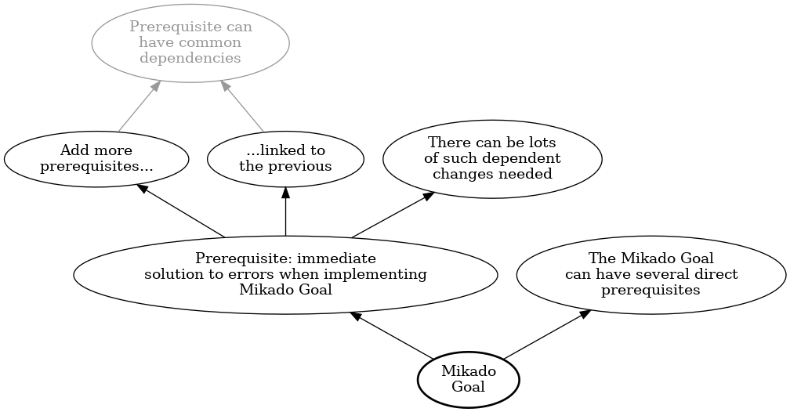

# `mikado`

`mikado` is a small Perl script to generate graphs for the
[Mikado method](https://mikadomethod.info/) using
[Graphviz](https://graphviz.org/).

The input format is simple:

    Mikado\nGoal
        -> Prerequisite: immediate\nsolution to errors when implementing\nMikado Goal
            -> Add more\nprerequisites...
                -> Prerequisite can\nhave common\ndependencies ✓
            -> ...linked to\nthe previous
                -> Prerequisite can\nhave common\ndependencies ✓
            -> There can be lots\nof such dependent\nchanges needed
        -> The Mikado Goal\ncan have several direct\nprerequisites

(The only case one has to duplicate nodes is when they are a dependency
for more than one node.)

And the result is good enough:

(This image was obtained with the command: `mikado --rankdir BT example.txt`.)

# Dependencies

Only [Perl](https://www.perl.org/) and [Graphviz](https://graphviz.org/)
are needed to run `mikado`.
